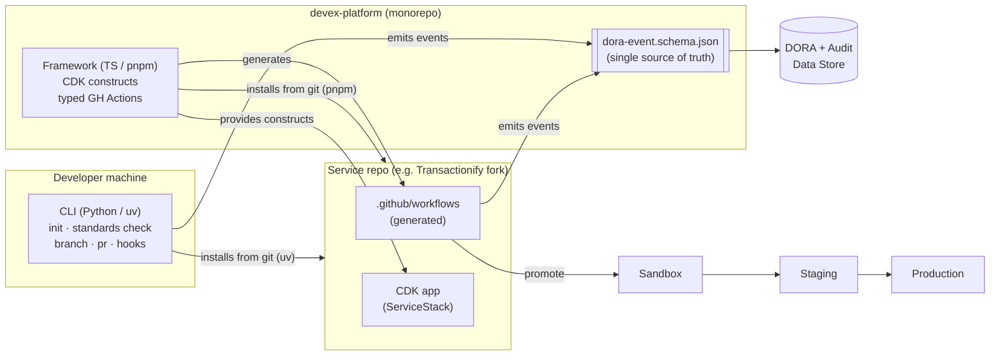

<!--
  ADR-001 — DevEx "Golden Path" Platform Architecture
  DELIVERABLE D7: export this to PDF, MAX 2 PAGES.
  Keep it tight. The diagram + the four required sections (Homologation,
  Scalability, Shift-Left, plus the architecture overview) must all fit.
  Export tip:  pandoc ADR-001-architecture.md -o ADR-001.pdf   (then check page count)
-->

# ADR-001 · The Golden Path DevEx Platform

**Status:** Proposed · **Date:** 2026-07-24 · **Author:** Vinicius · **Deciders:** DevEx Platform

## Context
LoanPro runs 10+ independent, full-cycle engineering teams across multiple languages
(Python, Go, Clojure, TypeScript). Without shared tooling, each team invents its own
git conventions, pipelines, and metrics — making DORA numbers **incomparable** and SOC 2
auditing inconsistent. We treat Developer Experience as a **product**: a "Golden Path"
that homologates the lifecycle while staying opt-in-friendly and non-blocking.

## Decision
Ship a two-component ecosystem, independently distributed from Git, wired together by a
single **language-agnostic event contract**:

- **Component A — CLI (Python, `uv`):** the developer-facing interface. Standardizes local
  workflows (`init`, `standards check`, branch/PR conventions, git hooks) and enforces the
  **Universal Work ID**. Emits audit/DORA events.
- **Component B — Framework (TypeScript, `pnpm`):** shared **AWS CDK constructs** +
  **type-safe GitHub Actions** generation (`github-actions-workflow-ts`). Produces the
  Stack-Aware PR pipeline and captures DORA metrics in CI.
- **Contract — `dora-event.schema.json`:** the single source of truth. Both components emit
  the same shape, so metrics are comparable regardless of team language.

<!-- ===================== ARCHITECTURE DIAGRAM (D7.a) ===================== -->
## Architecture

<!-- Replace with an exported PNG/SVG if the PDF renderer doesn't do mermaid. -->

## PR Pipeline (implemented) & Integration Pipeline (designed)
- **PR pipeline (built):** Small Tests (unit + Property-Based Testing + API contract) →
  Deployment promotion Sandbox → Staging → Production via CDK. Two-reviewer rule + PR template.
- **Integration pipeline (design-only for PoC):** triggered on merge to main; final validation
  + production deploy; same event schema, so DORA stays continuous across both pipelines.

<!-- ===================== HOMOLOGATION (D7.b) ===================== -->
## Homologation — how 10+ teams adopt both tools
- **Convention over configuration:** `cli init` scaffolds everything correct-by-default; the
  golden path is the path of least resistance.
- **Distribution from Git:** `uv tool install git+…` and `pnpm add git+…` — one command each,
  versioned by tag, no registry to manage.
- **Dogfooding + templates:** the platform repo and a reference service (Transactionify) run the
  exact pipeline, serving as a copyable starting point.
- **Enforcement at the edges:** git hooks + PR-pipeline gates make non-conformance fail fast,
  so adoption is pulled by developers, not pushed by mandate.

<!-- ===================== SCALABILITY (D7.c) ===================== -->
## Scalability — avoiding the platform-team bottleneck
- **Inner-source model:** teams contribute via PRs against documented extension points
  (new language profile, new pipeline stage) — see `CONTRIBUTING.md`.
- **Stack-Aware, pluggable steps:** language support is data/config, not a fork; adding Go/Clojure
  is additive, not a platform rewrite.
- **Library, not a service:** the framework is a versioned dependency teams pin and upgrade on
  their own cadence — the platform team is not in the request path.

<!-- ===================== SHIFT-LEFT (D7.d) ===================== -->
## Shift-Left Strategy
- **Pre-push git hooks (CLI-managed):** run tests/lint before code leaves the machine.
- **Fast PR "Small Tests" stage:** unit + PBT + API-contract validation before any deploy.
- **Local environment parity:** run the service + dependencies locally to execute tests without
  cloud latency — shrinking the defect-introduction → detection gap (a scored feedback-loop metric).

## Consequences
- **+** Comparable DORA across languages; consistent SOC 2 audit trail; low-friction adoption.
- **+** Platform team scales by curation, not by doing every team's pipeline work.
- **−** Two runtimes (Python + TS) to maintain; contract changes require coordinated releases.
- **−** Git-based distribution trades registry ergonomics for zero-publish simplicity (acceptable for PoC).

## Alternatives considered
- **Single-language toolchain** — rejected: violates polyglot future-proofing.
- **Central CI service owned by platform team** — rejected: recreates the bottleneck we must avoid.
- **Hand-written YAML templates** — rejected: no compile-time safety; drifts per team.
